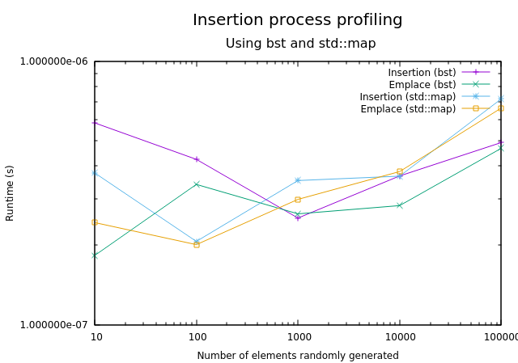
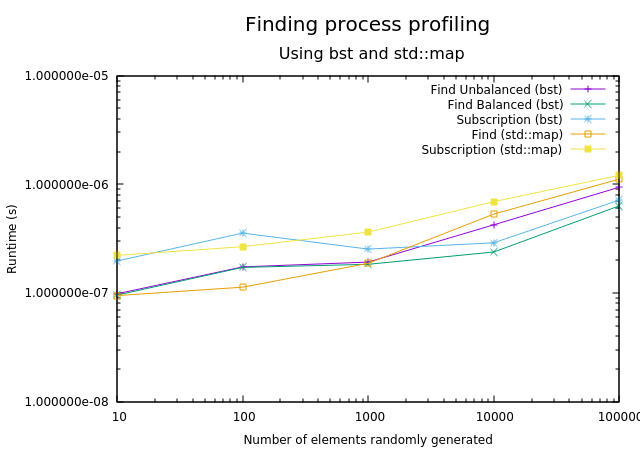

# Exam report - P1.3 MHPC

Student: Luis G. Leon Vega

Period: 2019-2020

## Report statement

Test the performance of the lookups (using the function find) before and 
after the tree is balanced. Use proper numbers (and types) of nodes and 
lookups. Use the proper compile flags. Does lookup behaves as `O(log N)`? 
How your tree compares with `std::map`?

## Contents

This report illustrates the profiling results of the implemented BST in terms 
of insertion time, emplacement time, and copy semantics. Besides, this report
also presents the results of the lookups before and after balancing the tree
for different tree sizes. Also, the results are constrasted against a 
`std::map` container.

## Profiling results

### Brief setup details 

After the implementation, the code correctness was verified by enabling the
verbosity of the code and seeing the several cases tested in the 
[main.cpp](main.cpp) file. After the correctness tests, the profiling part
was taken by disabling the verbosity, keeping the `ENABLE_PROFILE` switch
enabled, and running the `generate_report.sh` script as follows:

```bash
cd $REPO_DIR
./generate_report.sh
```

For detailed information (and see the raw data acquired), please feel free
to check the reports in `reports/`. You will find the results for both: 
bst and `std::map`.

### Results

The transactions which have been taken into consideration for analysis in
this section were mainly the *insertion*, *emplace*, *subscription*, *find*, 
*copy*, *move*, and *clean*.

1. **Insertion**

The insertion process takes into account one lookup and decides if a new 
node should be built or not. The insertion process can be done either by
using the `insert()` or `emplace()` methods.



The picture presented above summarises the performance of the insertion
process in both, the *bst* and the `std::map`. It is possible to notice

2. **Finding**

Additionally to the insertion, the lookups are also performed by the 
subscription operator and the `find()` method. For this case, the subscription
performs an insertion in case that the element is not in the tree.



3. **Semantics**

In the case of the copy/move semantics


4. **Cleaning**


## Lookups performance


### BST

### `std::map`