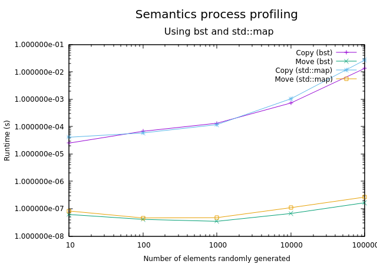

# Exam report - P1.3 MHPC

Student: Luis G. Leon Vega

Period: 2019-2020

## Report statement

Test the performance of the lookups (using the function find) before and 
after the tree is balanced. Use proper numbers (and types) of nodes and 
lookups. Use the proper compile flags. Does lookup behaves as `O(log N)`? 
How your tree compares with `std::map`?

## Contents

This report illustrates the profiling results of the implemented BST in terms 
of insertion time, emplacement time, and copy semantics. Besides, this report
also presents the results of the lookups before and after balancing the tree
for different tree sizes. Also, the results are compared against a 
`std::map` container.

## Profiling results

### Brief setup details 

After the implementation, the code correctness was verified by enabling the
verbosity of the code and seeing the several cases tested in the 
[main.cpp](main.cpp) file. After the correctness tests, the profiling part
was taken by disabling the verbosity, keeping the `ENABLE_PROFILE` switch
enabled, and running the `generate_report.sh` script as follows:

```bash
cd $REPO_DIR
./generate_report.sh
```

For detailed information (and see the raw data acquired), please feel free
to check the reports in `reports/`. You will find the results for both: 
bst and `std::map`.

### Results

The transactions which have been taken into consideration for analysis in
this section were mainly the *insertion*, *emplace*, *subscription*, *find*, 
*copy*, *move*, and *clean*.

1. **Insertion**

The insertion process takes into account one lookup and decides if a new 
node should be built or not. The insertion process can be done either by
using the `insert()` or `emplace()` methods.


The picture presented above summarises the performance of the insertion
process in both, the *bst* and the `std::map`. It is possible to notice that 
the insertion and emplacement in the `std::map` behaves similarly, whereas in 
the *bst* case, it is different. The difference could be due to caching or 
another kind of phenomenon, given that the emplacement uses the insertion 
method inside.

Besides, the insertion process in bst is faster than the `std::map` when the 
number of elements reaches the `100'000`, whereas for smaller cases (tens),
the `std::map` behaves faster but inside of the same order of magnitude.

This means that the bst implementation is competitive even when the tree hasn't
been balanced, since the balancing affects given that before inserting, the
implementation performs a lookup for the leaf/node to be filled.

2. **Finding**

Additionally to the insertion, the lookups are also performed by the 
subscription operator and the `find()` method. For this case, the subscription
performs an insertion in case that the element is not in the tree.


In the case of *bst*, the subscription operator has been invoked after 
balancing the tree. For that reason, the behaviour of the `Find Balanced` and the `Subscription` should be similar.

According to the plot, the *bst* implementation performs better than the 
`std::map` after the `1000s` of elements. However, it is possible to notice 
that almost from the begining, the *bst* subscription behaves much better than 
the `std::map`.

3. **Semantics**

In the case of the copy/move semantics, the copy assignment and move 
constructor were used for performance measurements. The difference between 
assigment and construction is small. Nevertheless, the construction results in
better results.



The plot for the semantics illustrates that the performances between moving and
 copying the trees in both, the *bst* and `std::map` are almost the same. In 
 the case of the move semantics, it is just move the pointer, and it doesn't 
 take significant computational resources.

4. **Cleaning**

The cleaning process behaves similarly in both cases.


## Lookups performance

Going deeper into the lookup performance, by definition, the behaviour should follow an `O(log(n))`, where `n` is the number of elements in the tree.


The plot shown above depicts the behaviour of the lookups in the *bst* and 
`std::map`. For the *bst* case, there are two possible scenarios. The first 
one given by an unbalanced tree and the second one after balancing the tree 
naively.

For the unbalanced case, the performance of both approaches 
(*bst* and `std::map`) is quite similar. They follow the same tendency, being 
under the `O(log(n))` when the number of elements is lower than `100'000`. 
This consumption results in a desired case. However, when the number of 
elements starts to be near to the `100'000s`, the performance in both, *bst*
and `std::map` started to reach the ideal case. In general, the performance of 
*bst* is very competitive to the `std::map` when the tree is unbalanced and 
with a semi-random dataset.

On the other hand, the balanced case gave better results than the `std::map` 
and the *bst* with the tree unbalanced when the number of elements was greater 
than `1000`. This is expected since the balanced tree should be shorter than 
the unbalanced, since the balancing is in charge of minimising the tree's 
height.

## Conclusions

The *bst* implementation is competitive to the `std::map` found in the 
standard library. The performance results suggested that in copying, moving 
and inserting, the performance was close one to the other.